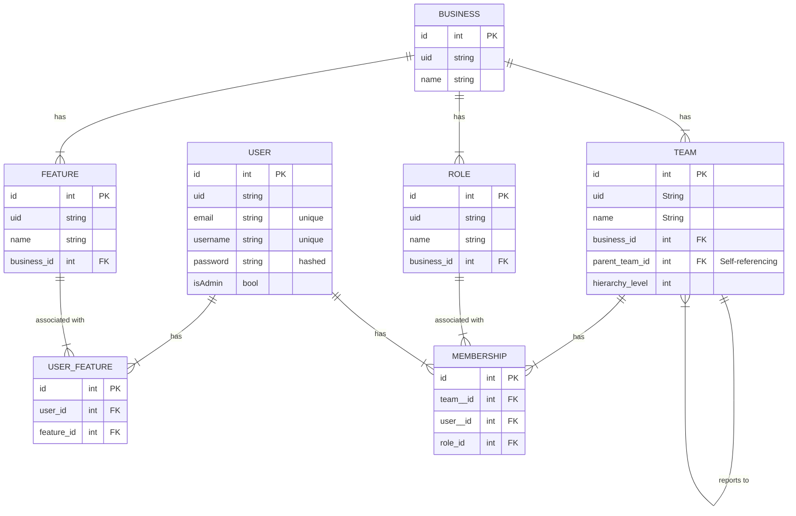

# TODOs

1. Clear to-dos in the codebase
2. When calling `Services` from `Modules`, resource owner such as `User` and `Team` can be loaded to scope the query result. 
   1. `this.team` or `this.user` in the request context. 
3. Enforce data and model validations with DTOs.
4. Include and map ID to associated UID in data serialization.
   1. **DO NOT** expose DB primary key but expose object UID.
5. Improve auth module
   1. Improve permission cache efficiency and by using `redis` or extract as a separated service
6. Optimize user permission cache clean up when update/delete related records
   1. `Business`
   2. `Membership`
   3. `Team`
   4. `Role`

## General setup/configuration

1. [ ] Grace shutdown
2. [ ] Logger
3. [ ] Email services
4. [ ] Tests 

## Database and data integrity 

1. [x] DB client 
2. [ ] Seed data
3. Refactor model/entity specific logic from service to Prisma model extensions
   1. [ ] Data soft delete and cascade
   2. [ ] Prefix to generate entity UID

## Security

1. Authentication module
   1. [x] Sign-up/create user (default role and permission)
   2. [ ] Edit/update user
   3. Route guards
      1. [x] Public route guard
      2. [x] Private route guard
      3. [ ] Service/Feature guard
   4. Blacklist tokens - fulfilled by versioning in permission cache
      1. [x] Access token - including permissions cache
      2. [x] Refresh token
2. Authorization module
   1. [x] Assign role(s) to user
   2. [x] Assign permission to user
   3. [x] Revoke user permission
   4. [ ] Edit/update user role(s)
3. [ ] Rate limiting
4. [ ] CSRF

## Developer experience (DX)

1. [ ] Open API
2. [ ] Makefile (universal local setup)

---

# Authn and Authz

## Authentication

1. `access_token` lives `15mins`.
2. `refresh_token` stays `1day`.
3. Payload in access token is always assumed valid unless the token is blacklisted. 
4. Used refresh token is not 

### Access token

1. Permissions are listed in access tokens to provide better performance on validating requests.

#### Access token guard 

1. Check if access token is valid.
2. Check if access token is blacklisted.
3. Check if access token carries required permissions in payload. 

### Refresh token

1. Strategy is to keep as least records as possible.
2. Based on `RefreshToken` of the user which **WILL NOT** rotate when issuing new access token. 
3. When a refresh token is used for refreshing access token, an update record will be kept. 

#### Refresh token guard

1. Check if refresh token exists.
2. Check if refresh token is blacklisted.

## Authorization

1. Multiple business units as `Business` entities, including `Erisa` and `Erify`.
2. Every user has `PermissionCache` inferred from user's `Team` and `Memberships`.
   1. When `Roles` of a `Business` update, it should reflect to user's using such permission.
   2. When a `Team` and `Membership` is updated, the `PermissionCache` of the user should be updated.

## Features

1. A `User` can work at multiple `Teams`.
2. A `User` can have multiple roles at a `Team`. 
3. `Roles` at a `Business` can be different from the other `Business`.
4. Creating relationships in hierarchy associating `Business` and `User` through `Team`.
5. `Team` is the main resource owner.

## Permission cache
1. Cache is stored in the main db in `permissions_cache` table and is associated to a `User`.
2. `PermissionsCache` is inferred from a `User`'s `Membership` which is associated with `Team` and `Role`.

## ERD

